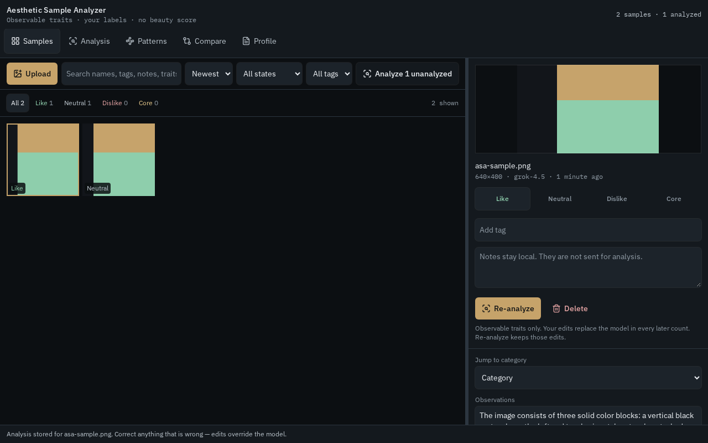
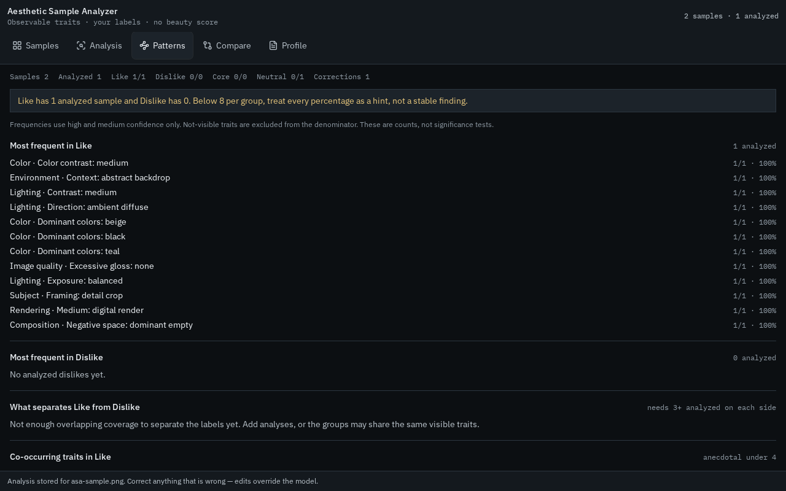
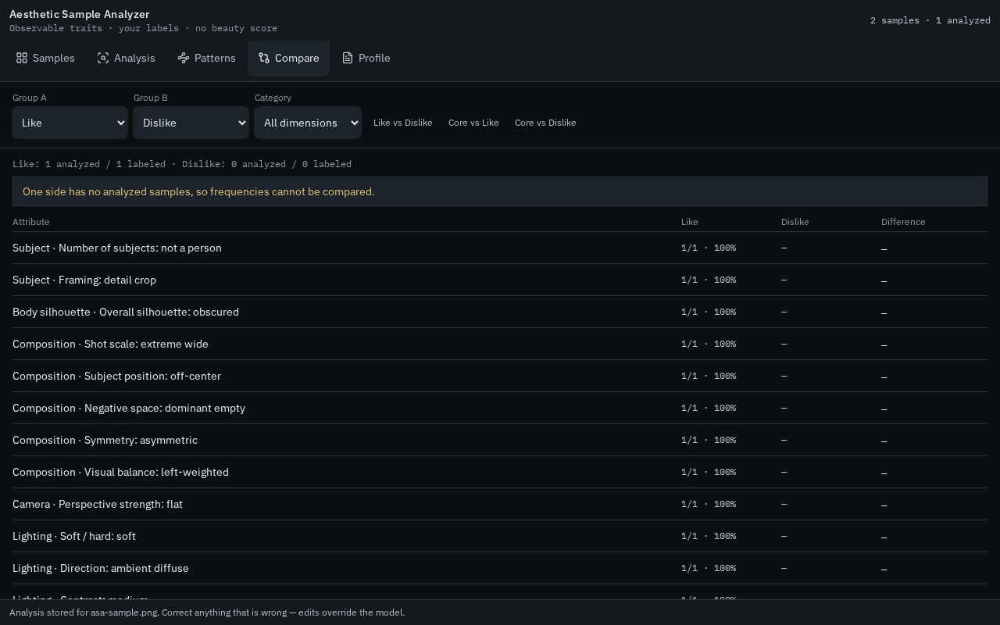
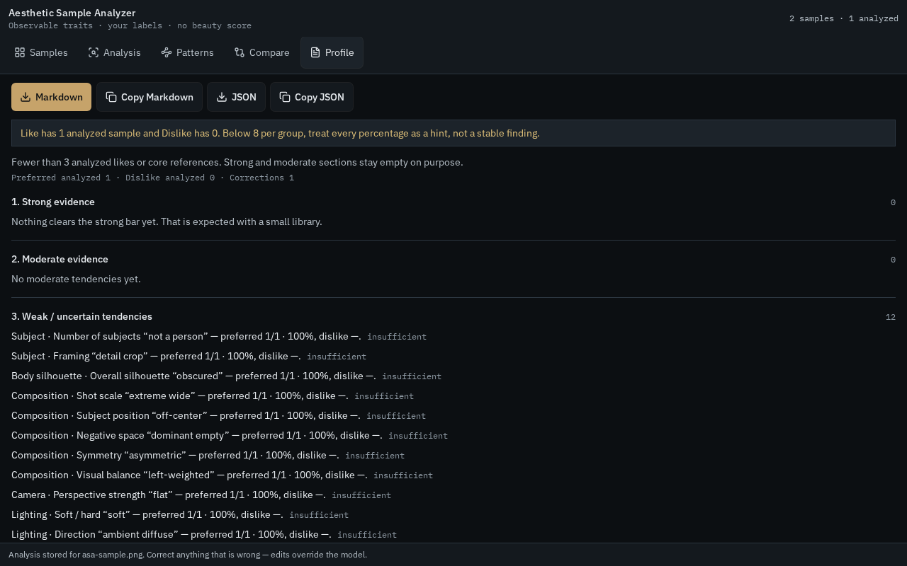

# Aesthetic Sample Analyzer

A desktop-first research tool for discovering recurring visual preferences from a user-labeled image library.

The application does **not** decide whether an image is beautiful. You label each sample; the analyzer extracts observable visual attributes, lets you correct them, and compares the resulting patterns across your preferred and disliked groups.



## What it does

- Imports multiple reference images into a dense, filterable sample library.
- Assigns one of four user-controlled labels: **Like**, **Neutral**, **Dislike**, or **Core Reference**.
- Stores tags and notes alongside each image.
- Extracts visible traits for subject, face, hair, silhouette, clothing, composition, camera, lighting, color, rendering, environment, mood, and image quality.
- Records a confidence level for every extracted attribute.
- Keeps all model-generated attributes editable; user corrections take precedence and survive re-analysis when possible.
- Finds frequent traits, distinguishing attributes, co-occurring combinations, contradictions, rare preferences, outliers, and dimensions with insufficient evidence.
- Compares labels or custom tag groups with counts, percentages, percentage-point differences, and representative images.
- Builds an evidence-tiered aesthetic profile and exports it as Markdown or structured JSON.
- Exports and imports the complete working library, including images, labels, notes, corrections, and analyses.

## Product principles

1. **The user supplies preference labels.** The model observes; it does not assign taste or beauty scores.
2. **Corrections outrank automation.** Every generated value is editable and corrected data is used in later statistics.
3. **Small samples stay uncertain.** The UI displays sample counts and deliberately avoids strong claims when evidence is sparse.
4. **Only visible traits are analyzed.** The schema excludes identity, ethnicity, personality, profession, socioeconomic status, and other hidden personal characteristics.
5. **No prompt generation in version 1.** This is an analysis tool, not an image generator or prompt extractor.

## Main views

| View | Purpose |
| --- | --- |
| **Samples** | Upload, label, tag, annotate, filter, sort, and remove reference images. |
| **Analysis** | Review model observations and edit individual attributes and confidence levels. |
| **Patterns** | Explore recurring traits, distinctions, combinations, contradictions, outliers, and evidence gaps. |
| **Compare** | Compare any two preference or tag groups across visual dimensions. |
| **Profile** | Review strong, moderate, and weak tendencies; explicit dislikes; important combinations; and exports. |

## Getting started

### Requirements

- Node.js `^20.19.0` or `>=22.12.0`
- npm
- An `XAI_API_KEY` for live vision analysis

The library, labels, manual edits, statistics, comparison tools, and exports work without an API key. Only automated image analysis requires xAI access.

### Install and run

```bash
npm ci
```

Set the API key in the server process environment. Do not commit it to the repository.

PowerShell:

```powershell
$env:XAI_API_KEY = "your-key"
npm run dev
```

Bash:

```bash
export XAI_API_KEY="your-key"
npm run dev
```

The development server listens on `0.0.0.0:8080`.

## Available commands

| Command | Description |
| --- | --- |
| `npm run dev` | Start the development server. |
| `npm run build` | Create a production build and run the configured migration step. |
| `npm run preview` | Preview the production build. |
| `npm run typecheck` | Run TypeScript checks without emitting files. |
| `npm test` | Run the script, statistics, data, and authentication test suites. |
| `npm run lint` | Run ESLint. |
| `npm run format` | Format the repository with Prettier. |
| `npm run check:auth` | Validate the authentication configuration invariants. |

## Data and privacy

- Images and working data are stored locally in the browser with IndexedDB under `aesthetic-sample-analyzer`.
- Authentication and the shared database are disabled in the included application configuration.
- An image is sent to the xAI API only when an analysis action is triggered.
- `XAI_API_KEY` is read only by the server-side analysis function and is not exposed through a browser environment variable.
- Library export creates a local JSON backup containing the images and their associated metadata.
- The server rejects analysis payloads larger than 1.8 MB as encoded image data.

## Analysis and evidence model

Vision analysis currently uses `grok-4.5` with a constrained JSON schema. Each field stores:

- the normalized value;
- confidence: `high`, `medium`, `low`, or `not_visible`;
- whether the user edited it; and
- the original model value when a correction exists.

Pattern statistics exclude low-confidence or non-visible observations where appropriate. The interface treats comparisons with fewer than eight analyzed samples per side as exploratory and keeps strong profile sections empty until minimum evidence thresholds are met.

## Project structure

```text
src/
  components/asa/       Application views and reusable UI pieces
  lib/asa/              Schema, storage, analysis, statistics, exports, and state
  routes/               TanStack Start routes
scripts/                Build, preview, migration, branding, and browser checks
server/                 Server middleware
migrations/             Optional authentication database migration
public/                  Static application and install assets
screenshots/             Desktop/mobile QA captures and verdicts
```

The UI is built with React 19, TanStack Start/Router, Tailwind CSS, Radix primitives, Zustand, and `react-resizable-panels`.

## Current limitations

- The active library is local to one browser profile unless it is exported and imported elsewhere.
- There is no account sync or multi-user collaboration in the included configuration.
- Automated analysis depends on xAI API availability and the configured model.
- Statistical output describes correlations in the current labeled library; it is not a universal statement about the user's taste.
- Version 1 intentionally does not generate images or prompts.

## Additional screenshots

| Samples | Patterns | Compare | Profile |
| --- | --- | --- | --- |
|  |  |  |  |

Mobile layouts are also covered by the included browser QA captures in [`screenshots/`](screenshots/).
